# matplotlib

<b> Plot </b>

1. Simple Plot 
 
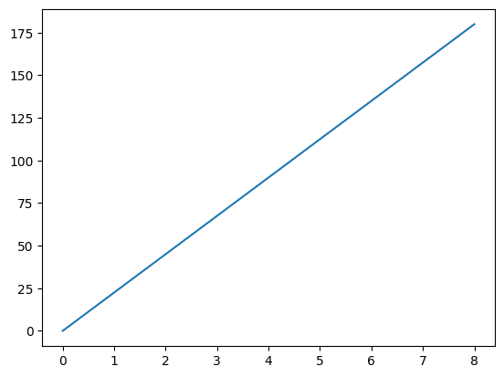
 
 

2. Plot with breakpoints
 

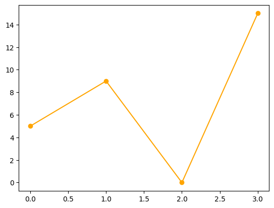
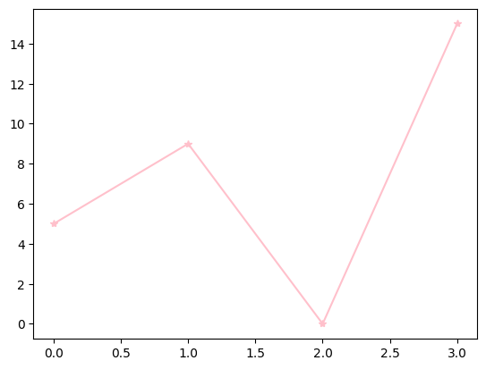
 
 

3. Plot with linestyle
 

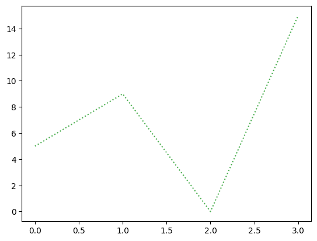
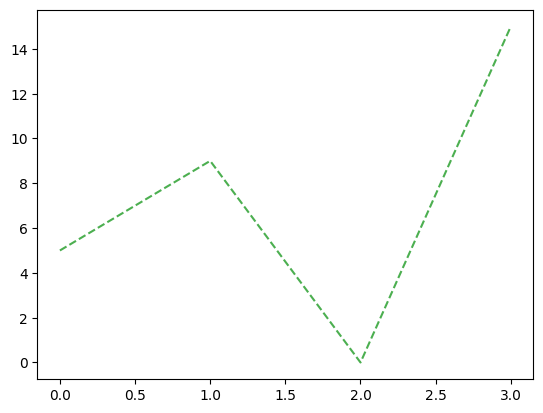
 
 

4. Plot with graid
 

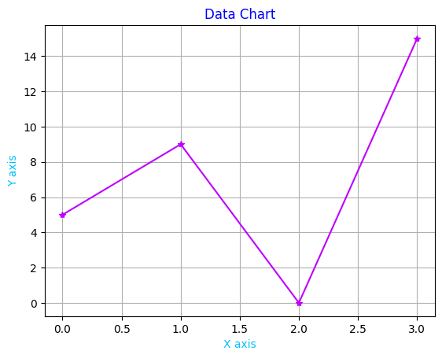
 
 

5. subplot
 

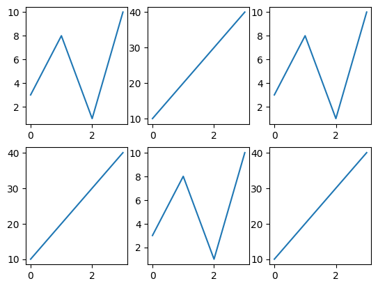
 
 

6. scatter
 

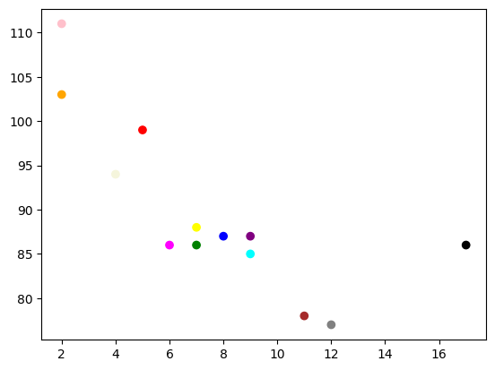
 
 

7. bar
 

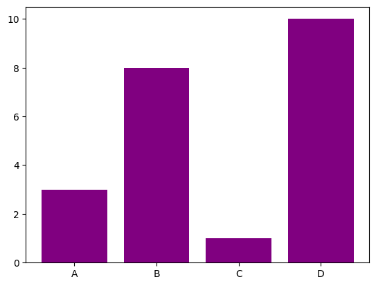
 
 

8. barh
 

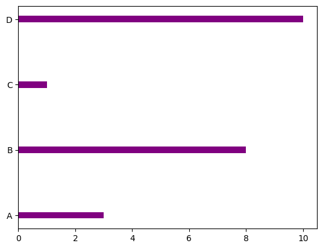
 
 

9. hist
 

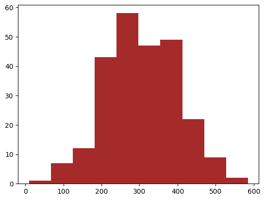
 
 

10. pie
 

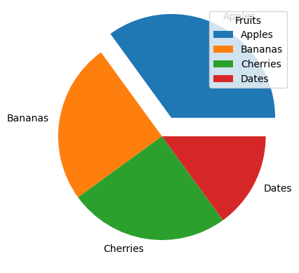
 
 

